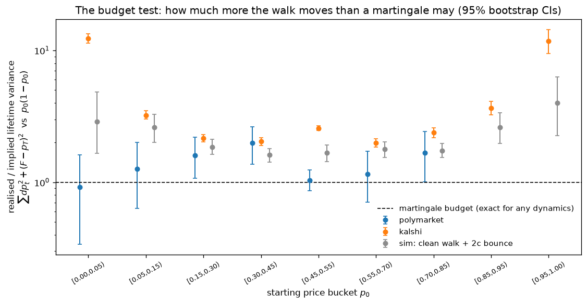
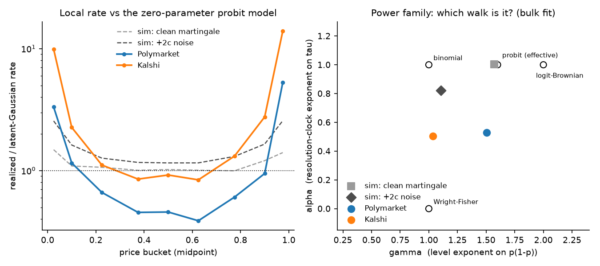
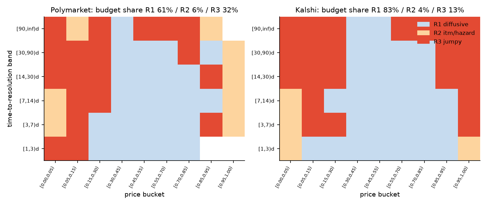
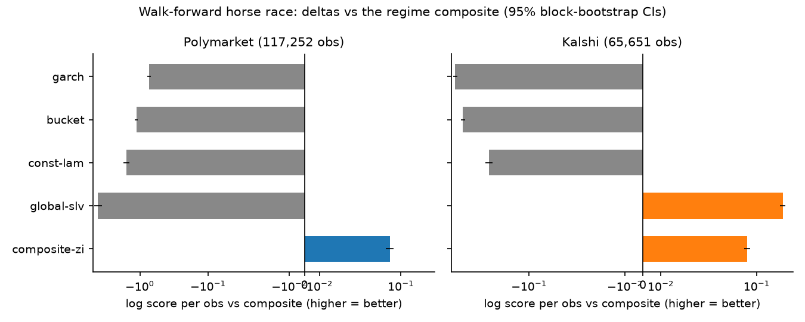
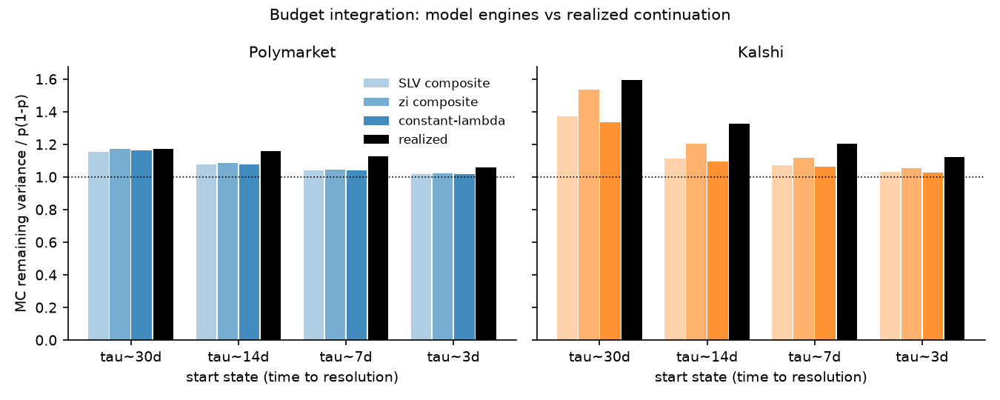
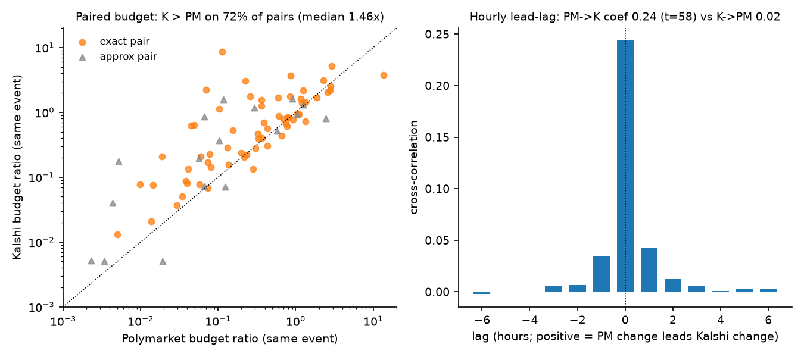

# prediction-market-vol

What kind of random walk does a prediction-market price follow?

A prediction-market price is a probability: `p_t = E[1_event | F_t]`, a
martingale confined to [0,1] and absorbed at 0 or 1 when the event resolves.
That single fact makes every default habit from equity volatility modeling
wrong, and it makes some remarkable model-free statements possible.

The repo is a data pipeline plus an empirical study on one frozen vintage
(markets resolved by 2026-09-06): 3,382 resolved Polymarket markets (219,593
daily moves), 27,465 resolved Kalshi markets (708,078 daily moves), and
hourly bars for 82 cross-venue matched pairs. The study runs in two arcs:

1. **One venue at a time**: identify the process. Variance budget, the right
   [0,1] coordinate, a regime map, a stochastic-local-vol state space with a
   zero-inflated tick observation layer, an out-of-sample horse race, and a
   budget-consistency audit of the fitted model.
2. **Two venues, one event**: 82 hand-matched contract pairs (Fed decisions,
   Fed chair, BTC, elections) turn venue comparisons into controlled
   experiments: who spends more variance on the same event, and who moves
   first.

Companion documents:

- **[THEORY.md](THEORY.md)**: the modeling framework. Why log returns are the
  wrong coordinate, the variance-budget identity, the three-layer hierarchy
  of admissible models, and why an equity-style Heston model cannot be
  transplanted verbatim.
- **[NOTES.md](NOTES.md)**: results in full, and every place the live APIs
  differed from their documentation (a 100x scaling trap in Kalshi's
  historical candlesticks, start-stamped daily candles, a truncating
  Polymarket history endpoint, and more).

Every number quoted below is registered in `check_docs.py`, which recomputes
it from `results_v2/` and fails on mismatch; `python run_all.py` reproduces
the whole build in order.

## Arc 1: what process is the price?

### Three structural constraints

1. **Log returns explode.** Near p = 0 log returns blow up; near p = 1 they
   compress to nothing. The natural increment is the price difference dp.
2. **Volatility must depend on the level.** A price at 0.02 cannot move like
   a price at 0.50; the boundary forbids it. "What is the vol?" is not
   well-posed. The right question is: which function of (p, tau) is the local
   variance rate, where tau is time to resolution?
3. **The clock is time-to-resolution.** The price must reach 0 or 1 at the
   deadline. A market still at 0.5 near expiry must move violently; a market
   pinned at 0.98 must barely move. Calendar-time vol models (GARCH etc.)
   have no mechanism for either.

### The variance budget: each market quotes its own implied variance

For any martingale absorbed at 0/1, squared increments telescope into the
variance of the terminal Bernoulli outcome:

```
E[ sum_t dp_t^2 + (final - p_last)^2 ] = p0 (1 - p0)
```

This is model-free: it holds under stochastic vol, jumps, staleness, any
dynamics at all. `p(1-p)` is the market's own model-free implied integrated
variance, the exact analog of a variance-swap strike, quoted by the price
itself. Comparing realized lifetime variance to it is a realized-vs-implied
comparison, bucketed by starting price so the excess cannot hide in a pooled
slope:



| venue | resolved markets | pooled slope | reading |
|---|---|---|---|
| Polymarket | 3,382 | **1.19** | ~19% excess movement, roughly uniform in p |
| Kalshi | 27,465 | **1.43** | bulk 1.2-1.6x; extreme-p buckets 7.4x and 12.9x |

The calibrated simulator (latent-Gaussian truth with noise/staleness/
stochvol knobs) provides benchmarks: a clean martingale gives slope 0.99,
2 cents of additive bid-ask noise pushes it to 1.21, and staleness leaves it
unbiased. The signed z-ACF separates the mechanisms: Kalshi's lag-1
autocorrelation of standardized moves is -0.280, the classic bounce
signature (the noise sim gives -0.195); Polymarket's is -0.115. Squared
standardized moves cluster on both venues (lag-1 lambda-ACF +0.19 and
+0.22): a genuine stochastic-vol layer on top of whatever the local law is.

### Which coordinate makes it a clean walk?

Black-Scholes is really a choice of coordinate: log-price is the scale on
which equity increments are homoskedastic. The same move exists on [0,1].
A local rate `Var(dp) = f(p) dt` is flattened by any transform g with
`g'(p) = f(p)^(-1/2)`, so choosing a transform and choosing a local-vol
function are the same choice:

| local rate f(p) | flattening transform | the walk |
|---|---|---|
| p(1-p) | arcsin(2p-1) | Wright-Fisher angular scale |
| [p(1-p)]^2 | logit(p) | log-odds Brownian motion |
| phi(Phi^-1(p))^2 | probit(p) | latent Gaussian signal |

Fitting the power family `E[dp^2/dt] = c [p(1-p)]^gamma / tau^alpha` on
(p, tau) cell means asks the data which walk it is:



| sample | gamma | alpha | reading |
|---|---|---|---|
| sim, clean probit truth | 1.57 | 1.00 | recovers the generating model |
| sim, 2c additive noise | 1.11 | 0.82 | noise drags both exponents down |
| polymarket bulk | **1.51** | **0.53** | between angular and logit; clock slower than 1/tau |
| kalshi bulk | 1.03 | 0.51 | dragged toward gamma = 1, the bounce direction |

Polymarket's level exponent sits between the Wright-Fisher and logit scales,
close to the probit walk's effective exponent; Kalshi's is pulled toward 1
exactly the way simulated state-independent noise pulls it. Both venues run
their clock at roughly `tau^-0.5`, slower than the `1/tau` a
constant-information-rate model implies: information arrives front-loaded
relative to the resolution clock. (An earlier 290-market Polymarket
vintage put gamma at 1.95 and read it as log-odds Brownian motion; the
full-universe estimate walks that back.)

### The regime map: no single model covers the plane

Per-cell diagnostics (excess stillness beyond what tick-censored diffusion
predicts, bipower jump share, kurtosis of standardized moves) classify each
(price bucket, tau band) cell:



- **R1 diffusive**: the SLV core, where the probit walk holds
  (61% of Polymarket's variance budget, 83% of Kalshi's);
- **R2 itm/hazard**: decided-but-unresolved markets near a boundary, frozen
  prices punctuated by gaps (the credit analogy: jump-back-to-life risk);
- **R3 jumpy**: extreme kurtosis, mostly the endgame as tau -> 0. The
  endgame acceleration is size-driven on both venues, but the p(1-p)
  dependence lives in move size on Polymarket (total exponent 1.51) and in
  arrival frequency on Kalshi (0.61).

### The SLV core, and how the tick grid rescued it

The budget fixes total variance and the boundary pins the local factor, so
any admissible stochastic-vol model is forced into a stochastic-local-vol
form: `Var(dp) = c * phi(Phi^-1(p))^2 * lambda_t / tau^alpha`, with all the
Heston-style dynamics living in the information-flow intensity lambda_t
(log-AR(1) here, fitted by a collapsed-mixture Kalman filter). Dropping the
stochastic-vol layer costs 0.65 (PM) and 0.62 (Kalshi) nats/obs: intensity
clustering is the single most important ingredient.

Fitted on a continuous observation model, though, the intensity mixing
spread runs to any bound it is given: the Gaussian layer can only buy the
data's many exact-zero days by making vol-of-vol huge. The fix is to put the
observation where the data lives, on the venue tick grid, with an explicit
staleness point-mass:

- **Polymarket**: a zero-inflated tick layer (pi0 = 0.28 of daily
  observations are stale repeats) brings the spread interior (s = 2.10) and
  is decisively preferred (+0.27 nats/obs). Staleness was the missing mass.
- **Kalshi**: tick censoring alone does it (s = 2.56 interior with
  pi0 ~ 0); one-cent rounding already absorbs the zeros. Same symptom, two
  venue-specific mechanisms, and the PIT histograms flatten on both.

### Does it predict? The walk-forward horse race

Train on the first 50% then 75% of markets by resolution date, test on the
next block; every model is scored as log P(next tick move) on the venue tick
grid, so continuous and discrete models compete in the same measure.



- **The zero-inflated composite beats the plain composite on both venues**
  (+0.069 PM, +0.076 Kalshi nats/obs, bootstrap CIs excluding zero): the
  observation layer earns its keep out of sample.
- **GARCH, the imported equity default, loses by 0.73 and 0.83 nats/obs.**
  That gap is the quantitative price of ignoring the [0,1] geometry and the
  resolution clock.
- **The regime split is essential on Polymarket** (a single pooled SLV
  degenerates and loses 4.10 nats/obs) **but not on Kalshi**, where one
  global SLV wins outright (+0.21, ahead in every regime): with 8x more
  markets per fit, the latent-intensity mixture spans the frozen and jumpy
  cells on its own.

### Does it integrate? The budget consistency audit

One-step likelihood can flatter a model that compounds into nonsense, so the
fitted composite is rolled forward by Monte Carlo from mid-life states and
its remaining variance compared to the p(1-p) budget and to the realized
continuation of the same markets:



Model engines land on the budget and near the realized ratios at every
horizon (Polymarket 30d: model 1.16 vs realized 1.17; Kalshi 30d: model 1.38
vs realized 1.60, the residual gap being Kalshi's longshot excess). An
earlier vintage of the fit overshot 2-6x; the zero-inflated layer is what
closed it, by removing the heavy intensity tail the Gaussian layer needed.
Caveat: from these states nearly all remaining variance (99%+ of the ratio
numerator) rides the jump/terminal channel, so this is an audit of totals,
not of path texture. Of lifetime spend, the terminal resolution jump carries
39% on Polymarket and only 4% on Kalshi, whose markets grind to their
outcome through final-day trading instead of leaping there.

### Is a venue one population? Outcome-free clustering

Everything above pools markets, either venue-wide or within hand-drawn
regime cells, and the fits showed classic mixture symptoms (boundary
parameters, exponents landing between named candidates). So: cluster the
markets themselves. Each market gets an outcome-free fingerprint built only
from its traversal path; the clustered features describe the law of the
standardized increments `z = dp / gauss_rate(p, tau)` (excess stillness,
mean intensity, lumpiness, late-vs-early intensity shift, bounce), so the
clusterer sees the dynamics rather than where the path happened to live.
That normalization is load-bearing: on a simulated two-population mixture
that a supervised probe separates almost perfectly, clustering raw path-shape
features recovers essentially nothing, because likelihood gains on
size/shape nuisance axes drown the dynamics signal; state-normalizing
first recovers the truth cleanly (majority-collapsed ARI 0.955). A
from-scratch EM-GMM with held-out model selection (split by contract)
chooses k = 8 on both venues.

- **Clusters are dynamics, not topics.** Adjusted Rand vs category
  metadata: 0.007 (Polymarket), 0.016 (Kalshi). The discovered types cut
  across Sports/Politics rather than rediscovering them.
- **The venue-level budget slopes decompose.** Kalshi's excess movement is
  carried by two types: an 11% high-intensity cluster with budget slope
  3.50 and a 5% cluster at 2.62; the largest cluster (33% of markets) sits
  at 1.19, near the venue line. Polymarket splits into a 15%
  excess-movement type (slope 1.80, its most political cluster) against a
  12% dead-until-resolution type (96% of days still, slope 0.71), plus a
  small 0.8% type that spends 99.5% of its variance in the terminal jump.
- **The venue-wide power exponent is an aggregation blend.** Refit within
  clusters, Kalshi's level exponent gamma separates from 0.58 to 2.30
  around the venue-wide 1.03; Polymarket's two largest fittable clusters
  land at 1.38 and 1.87 around the venue-wide 1.51. Most small or still
  clusters lack the cells to support a fit, and one Polymarket cluster
  (the zero-stillness type) fits degenerately; the cards report them as-is.
- **The SLV gate splits by venue, again.** Refitting the R1 SLV separately
  per partition and scoring identical held-out segments: on Kalshi the
  cluster partition beats both the category baseline and the global fit
  (1.175 vs 1.166 vs 1.156 nats/obs); on Polymarket the category partition
  wins (1.634 vs 1.620 cluster vs 1.616 global). The mirror image of the
  horse race, where the split helped Polymarket and hurt Kalshi. Caveat:
  cells below a 2,000-step training floor fall back to the global
  parameters (3 of 8 Polymarket cluster cells support their own fit, 4 of
  8 on Kalshi), so both non-global partitions are only partly refit.

## Arc 2: two venues, one event

82 contract pairs listed on both venues (64 exact matches; the rest close
but flagged): 47 Fed decision buckets, 14 Fed chair candidates, 8 monthly
and 6 yearly BTC strikes, 7 election contracts. Matching the event turns
every venue comparison into a controlled experiment.



- **The venues disagree, persistently.** Mean absolute same-day gap is 2.4
  cents (median 1.1c; 1.9c on exact pairs vs 3.6c on approximate ones), 8.6%
  of pair-days differ by more than 5 cents, and the gap's within-pair AR(1)
  of 0.86 implies a 4.6-day half-life. Whatever closes these gaps operates
  on a timescale of days, not minutes.
- **Kalshi's excess variance is a venue effect, not composition.** On
  identical events Kalshi still spends 1.46x Polymarket's variance (Kalshi
  higher on 72% of pairs). The venue-level budget difference survives the
  strongest control available.
- **The local law moves with the venue too, partly.** On the matched panel
  Kalshi's level exponent rises to 1.34 (from 1.03 venue-wide) vs
  Polymarket's 1.53: put the same events on both venues and the walks look
  far more alike, with a residual bounce-flattening on Kalshi.
- **Polymarket leads Kalshi.** On the hourly panel (198,224 aligned obs),
  lagged Polymarket changes predict Kalshi changes with coefficient 0.24
  (t = 58); the reverse coefficient is 0.02. Daily bars cannot settle this
  direction question at all: Kalshi stamps daily candles at the window start
  and Polymarket daily prices are midnight point samples, so same-label
  closes are hours apart and naive daily alignment manufactures a spurious
  lead (see NOTES.md).

## What "implied volatility" can mean here

- `p(1-p)` is a genuine model-free implied integrated variance, quoted by
  the price itself: the variance-swap strike of the market.
- The filtered intensity lambda_t is **not** an implied vol, and this repo
  does not call it one. Black-Scholes IV exists because two instruments (an
  option and its underlying) are priced on one filtration; a filtered
  intensity comes from one instrument's own realized path and is
  backward-looking.
- Genuinely forward-looking IVs need a second instrument: strike strips
  (bracketed events are digital-option strips whose cross-section is a
  risk-neutral distribution) and calendar pairs (by-T1 vs by-T2 contracts
  imply a hazard rate). A v1-vintage strike-strip construction validated
  against external markets (S&P strips at ~17% annualized vol, 10Y Treasury
  strips at ~100bp normal vol); see NOTES.md. Building these out on the v2
  vintage is the natural next layer.

## Reproduction

```bash
python -m venv .venv
.venv/Scripts/python -m pip install -r requirements.txt   # Windows

python run_all.py --list      # phases v1 (data pull) .. v65 (clustering)
python run_all.py             # rebuild everything, in order
python run_all.py --only v2   # one phase

python -m pytest tests -q     # oracle gates: every estimator must recover
                              # known parameters on simulated data first
python check_docs.py --strict # every number in this README, recomputed
```

Python 3.11+. No API keys; both venues are read publicly. The full data
pull (phase v1) takes several hours and lands in `data_v2/`; results and
the frozen scalars live in `results_v2/` (committed, so the doc check runs
without the raw data).

## Layout

```
analysis/config.py     the frozen vintage: every filter, floor, seed, path
analysis/core.py       market loading, state grid, exact-martingale simulator
analysis/empirics_v2.py   budget test, power family, ACF/kurtosis diagnostics
analysis/regimes_v3.py    regime map, SLV state space (IMM filter),
                          itm-hazard mixture, endgame decomposition
analysis/race_v4.py       zero-inflated tick layer, walk-forward horse race,
                          MC budget integration
analysis/bridge_v5.py     cross-venue pair table, gap/budget/power/lead-lag
analysis/figures_v6.py    every figure above, from results_v2/ only
analysis/cluster_v65.py   outcome-free fingerprints, EM-GMM, per-cluster
                          power fits and the partitioned SLV gate
pull_v2.py             resumable two-venue pull (scan, bars, tags, verify)
pull_v5_hourly.py      hourly top-up for the 82 bridge pairs
run_all.py             one-command driver, phases v1-v6
check_docs.py          claims registry: doc numbers recomputed or the build fails
pmdata/                venue adapters (shared with the v1 build)
tests/                 parser fixtures + simulation-oracle gates
results_v2/, figures/  frozen outputs; figures/v1/ keeps the v1-vintage figures
```

The v1 exploration (a smaller vintage with intraday and strike-strip
analyses not yet redone on v2) is retained under `analysis/vol_check.py` and
friends; its findings are kept, clearly labeled, in NOTES.md.

## Honest limitations

- Ticks floor measurable variance; extreme-p buckets are censored by the
  grid as well as by jumps. The zero-inflated layer models this at the
  observation level but the budget ratios there remain partly mechanical.
- Prices embed fees and any favorite-longshot premium; budget slopes mix
  excess movement with risk-premium effects, most visibly in Kalshi's
  extreme-p buckets.
- Both universes are top-N by volume (4,000 PM / 50,000 Kalshi markets), so
  conclusions are about liquid markets; the effective volume floors differ
  from the v1 build, which shifts sample composition as well as adding data.
- Resolution time is proxied by the last observed bar.
- Polymarket's history endpoint truncates at a market's end date: prices
  set between the scheduled end and actual resolution (the 2024 election
  night jump, for instance) never appear. This inflates election-domain
  gaps in Arc 2 and is flagged where it bites.
- 18 of the 82 bridge pairs are approximate matches (bucket-lumped Fed
  hikes, party-vs-candidate mayoral contracts, different BTC listing dates);
  they are flagged and their gap stats reported separately.
- The budget-integration audit is in-sample by design: a consistency check
  of the fitted object, not a second forecast contest.
