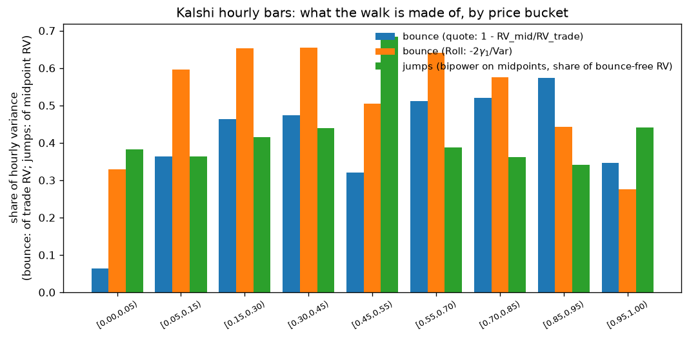
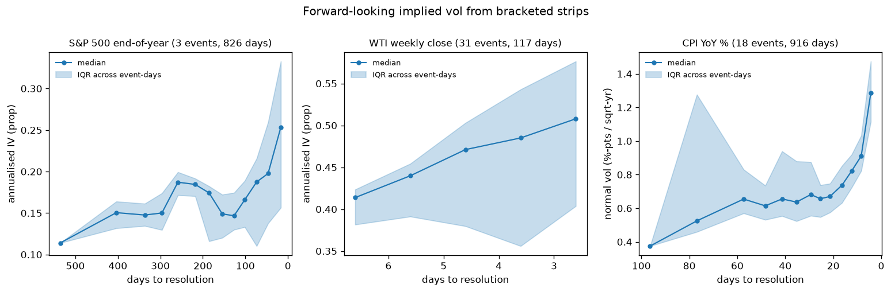
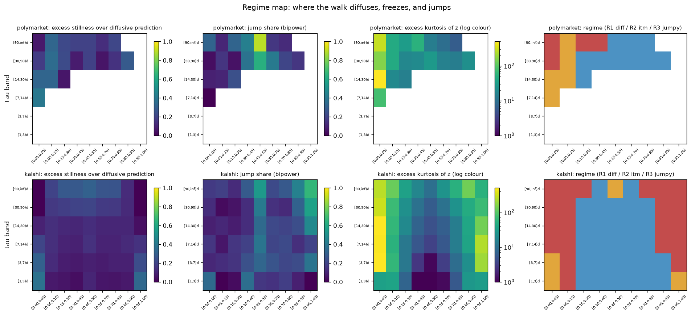

# prediction-market-vol

What kind of random walk does a prediction-market price follow?

A prediction-market price is a probability: `p_t = E[1_event | F_t]`, a
martingale confined to [0,1] and absorbed at 0 or 1 when the event resolves.
That single fact makes every default habit from equity volatility modeling
wrong, and it makes some remarkable model-free statements possible. This repo
is a data pipeline (Polymarket + Kalshi, ~9M bars in parquet/DuckDB) plus an
empirical exploration of how these walks actually move.

Companion documents:

- **[THEORY.md](THEORY.md)**: the modeling framework. Why log returns are the
  wrong coordinate, the variance-budget identity, the three-layer hierarchy of
  admissible models, why an equity-style Heston model cannot be transplanted
  verbatim, and three constructions of implied volatility.
- **[NOTES.md](NOTES.md)**: empirical results in full, and every place the
  live APIs differed from their documentation (including a 100x scaling trap
  in Kalshi's historical candlesticks).

## The walk is not free: three structural constraints

1. **Log returns explode.** Near p = 0 log returns blow up; near p = 1 they
   compress to nothing. The natural increment is the price difference dp.
2. **Volatility must depend on the level.** A price at 0.02 cannot move like
   a price at 0.50; the boundary forbids it. "What is the vol?" is not
   well-posed. The right question is: which function of (p, tau) is the local
   variance rate, where tau is time to resolution?
3. **The clock is time-to-resolution.** The price must reach 0 or 1 at the
   deadline. A market still at 0.5 near expiry must move violently; a market
   pinned at 0.98 must barely move. Calendar-time vol models (GARCH etc.)
   have no mechanism for either.

## The variance budget: each market quotes its own implied variance

For any martingale absorbed at 0/1, squared increments telescope into the
variance of the terminal Bernoulli outcome:

```
E[ sum_t dp_t^2 + (final - p_last)^2 ] = p0 (1 - p0)
```

This is model-free: it holds under stochastic vol, jumps, staleness, any
dynamics at all. `p(1-p)` is the market's own model-free implied integrated
variance, the exact analog of a variance-swap strike, quoted by the price
itself. Comparing realised lifetime variance to it is a realised-vs-implied
comparison; the figure plots the ratio of sums per starting-price bucket
(a pooled slope compresses the same information into one number and hides
where the excess lives).


| venue | resolved markets | slope | reading |
|---|---|---|---|
| Polymarket | 290 | **1.33** | ~33% excess movement, mostly informational |
| Kalshi | 12,731 | **2.41** | ~2-3x excess in the bulk, ~12x at extreme p, mostly microstructural |

A calibrated simulator (latent-Gaussian truth with noise/staleness/stochvol
knobs) provides the benchmarks: a clean martingale gives slope ~1.0, additive
bid-ask noise of 2 cents alone pushes it to 1.8 (the grey series in the
figure), and staleness leaves it unbiased. Kalshi sits above the pure-bounce
benchmark in every bucket, and the extreme-p buckets exceed what 2 cents of
noise alone produces. Kalshi's gap matches the noise signature (signed z-ACF lag-1 of
-0.27 vs -0.28 in the sim); Polymarket's does not (-0.09), so its excess is
behavioral/informational, the Augenblick-Rabin excess-movement effect.

## Which coordinate makes it a clean walk?

Black-Scholes is really a choice of coordinate: log-price is the scale on
which equity increments are homoskedastic. The same move exists on [0,1].
A local rate `Var(dp) = f(p) dt` is flattened by any transform g with
`g'(p) = f(p)^(-1/2)`, so choosing a transform and choosing a local-vol
function are the same choice:

| local rate f(p) | flattening transform | the walk |
|---|---|---|
| p(1-p) | arcsin(2p-1) | Wright-Fisher angular scale |
| [p(1-p)]^2 | logit(p) | log-odds Brownian motion |
| phi(Phi^-1(p))^2 | probit(p) | latent Gaussian signal |

(The transform must stretch the boundaries to infinity; anything with a
finite derivative at 0 and 1, e.g. arctan, fixes nothing.) Fitting the power
family `E[dp^2/dt] = c [p(1-p)]^gamma / tau^alpha` asks the data directly
which walk it is:


| sample | gamma | alpha | reading |
|---|---|---|---|
| sim, clean probit truth | 1.64 | 1.02 | recovers the generating model |
| sim, 2c additive noise | 0.68 | 0.32 | noise flattens both exponents |
| polymarket bulk | **1.95** | **0.84** | **log-odds Brownian motion on a resolution-scaled clock** |
| kalshi bulk | 0.81 | 0.40 | bounce-flattened, matching the noise sim |

This is the headline: Polymarket's bulk is strikingly close to logit-Brownian
motion with information flowing on the resolution clock. Kalshi is the same
object buried under bid-ask bounce; its exponents are dragged toward zero
exactly the way simulated state-independent noise drags them.

## Where the diffusion picture breaks

Three independent hourly-bar instruments (quote-vs-trade RV, Roll
autocovariance, bipower variation on midpoints) decompose the walk:



- Roughly **half of Kalshi's hourly trade-price variance is bid-ask bounce**;
  the signature ratio RV(1h)/RV(1d) has median 3.5.
- **Jumps carry 34-69% of the bounce-free variance**, peaking in the
  0.45-0.55 bucket: coin-flip markets move by discrete news arrivals, not
  diffusion. Excess kurtosis of standardised moves reaches several hundred
  near the boundaries; longshots sit still and then gap.
- Lambda-ACFs (squared standardised moves) are positive and decaying on both
  venues: genuine information-flow clustering, a real stochastic-vol layer.

The budget fixes total variance and the boundary pins the local factor, so
any admissible stochastic-vol model is forced into a stochastic-local-vol
form: `Var(dp) = phi(Phi^-1(p))^2 * lambda_t dt`, with all the Heston-style
dynamics living in the information-flow intensity lambda_t. A verbatim
Heston (free long-run variance, level-independent) violates the budget and
leaks probability out of [0,1]; see THEORY.md for the argument.

## Implied volatility, three ways

1. **p(1-p)** is a model-free implied integrated variance per market.
2. **lambda_imp = local dp^2 / [phi(Phi^-1(p))^2/tau]** strips the mechanical
   (p, tau) state-dependence the way BS-IV strips moneyness/maturity.
3. **Strike strips.** Kalshi bracketed events (S&P in [a,b], CPI above x) are
   digital-option strips: member prices at one instant are a full
   risk-neutral distribution of the underlying, giving a genuinely
   forward-looking IV.



The strips validate against external markets: S&P end-of-year strips imply
~17% annualised vol (VIX territory) and weekly 10Y Treasury strips imply
~100bp/sqrt-yr normal vol (the swaption convention and level). The same
quality gate that drops stale strips is what exposed the 100x scaling bug in
Kalshi's historical bars (NOTES.md, API fix #13): an S&P strip that sums to
0.011 instead of 1.000 is a very loud alarm.

## Modeling the three regimes (preliminary; horse race pending)

> Status: P0-P4 of the modeling phase are complete and oracle-gated
> (each estimator is validated on simulated data with known parameters
> before touching real data). The budget consistency check (P5) is in
> progress.

The diagnostics above say no single model covers the (p, tau) plane, so the
modeling phase starts by partitioning it. A per-cell regime map (excess
stillness beyond what tick-censored diffusion predicts, bipower jump share,
kurtosis of standardised moves) classifies every (price bucket, tau band)
cell into:

- **R1 diffusive**: the SLV core, where the probit walk holds;
- **R2 itm/hazard**: decided-but-not-resolved markets near a boundary (and
  Kalshi's dormant long-dated coin flips): frozen prices punctuated by gaps;
- **R3 jumpy**: the endgame, extreme kurtosis as tau -> 0.



| venue | R1 share of budget | R2 | R3 | R1 rectangle |
|---|---|---|---|---|
| Polymarket | 77% | 10% | 14% | p in [0.15, 0.95), tau >= 14d |
| Kalshi | 56% | 12% | 32% | p in [0.15, 0.85), tau >= 1d |

Each regime then gets its own oracle-gated model:

**R1 (core_slv.py)**: a stochastic-local-vol state space,
`Var(dp) = c * phi(Phi^-1(p))^2 * lambda_t / tau^alpha` with log lambda
AR(1), fitted by a collapsed mixture (IMM) Kalman filter with pooled
hyperparameters across markets. Dropping the stochastic-vol layer costs
0.56-0.69 nats/obs on both venues (LR p ~ 0): information-flow clustering
is the single most important ingredient. Honest flag: the fitted mixing
sd pins at its bound and the observation noise at its floor, and the PIT
histogram is center-humped: real R1 data has more exact-zero days than a
Gaussian layer can express, pointing at a zero-inflated observation layer
as the next refinement.

**R2 (itm_hazard.py)**: the credit analogy. On the venue tick grid,
`P(k) = pi0 * 1{k=0} + diffusion + hazard * gap(k)` with a two-sided
geometric gap and separate decay for away- vs toward-boundary moves.
Near-boundary near-expiry Kalshi cells show a ~10%/day hazard of a
~24-cent gap with 76% of gap mass jumping *away* from the boundary:
jump-back-to-life risk, the analogue of jump-to-default. Dormant coin
flips freeze the same way (pi0 ~ 0.4) but gap symmetrically.

**R3 (endgame.py)**: as tau -> 0 the budget forces the remaining
p(1-p) to be spent. Decomposing E[dp^2] = arrival rate x squared gap size
(with tick-censoring corrected by per-cell truncated MLE) shows the
endgame acceleration is **size-driven on both venues**: the tau exponent
sits almost entirely in the gap-size channel (b_size 0.30-0.38 vs
b_arr ~ 0.07). Late-life variance blowup means bigger moves, not more
frequent ones. The venues differ in where the p(1-p) dependence lives:
Polymarket in move size, Kalshi in arrival frequency. Model-free spend
profile: 21-27% of lifetime variance is spent in the final 30 days, and
the terminal resolution jump alone carries 10-14%.

### Does it predict? The out-of-sample horse race (horse_race.py)

Walk-forward by resolution date (train on the first 50% then 75% of
markets to resolve, test on the next 25% block), every model scored as
log P(next tick move) on the venue tick grid, so continuous and discrete
models compete in the same measure. Mean log score per observation
(higher is better; deltas vs composite carry 95% block-bootstrap CIs
over test markets, all excluding zero):

| model | Polymarket (24.5k obs) | Kalshi (285k obs) |
|---|---|---|
| composite (regime-split) | **-2.489** | -2.140 |
| global SLV (no regimes) | -6.760 | **-2.119** |
| GARCH(1,1) on dp | -2.839 | -3.005 |
| bucket (memorised cell variance) | -3.391 | -3.129 |
| constant-lambda SLV | -3.872 | -2.672 |

Three findings:

1. **The SLV structure beats every off-the-shelf baseline out of
   sample.** GARCH, the imported equity default, loses by 0.35 (PM) and
   0.87 (Kalshi) nats per observation; it captures vol clustering but has
   no level dependence and no resolution clock. That gap is the
   quantitative price of ignoring the [0,1] geometry.
2. **The regime split is essential on the small venue.** On Polymarket a
   single SLV fit over all cells degenerates (the frozen and jumpy cells
   poison the pooled fit) and loses catastrophically; the composite wins
   in every regime.
3. **On the large venue one SLV nearly suffices.** On Kalshi the global
   SLV edges the composite by 0.020 nats/obs, won in the R2 cells: the
   latent-intensity mixture, with its mixing spread pinned at the bound,
   imitates frozen-then-burst dynamics better than static per-cell tick
   mixtures. The regime map still earns its keep as measurement (the
   R2/R3 structure is real), but as *prediction* the SLV's intensity
   layer already spans it. The composite's randomised PIT on Kalshi is
   near-flat (deciles 0.083-0.110).

## Setup

```bash
python -m venv .venv
.venv/Scripts/python -m pip install -r requirements.txt   # Windows
```

Python 3.11+. No API keys; both venues are read publicly.

## Usage

```bash
# 1. build the universe (catalog of markets)
python -m pmdata.cli universe --venue polymarket --closed --min-volume 100000
python -m pmdata.cli universe --venue kalshi --status settled

# 2. backfill bars (1d first; 1h/1m are much heavier)
python -m pmdata.cli backfill --venue polymarket --freq 1d --limit 300
python -m pmdata.cli backfill --venue kalshi --freq 1d

# 3. inspect via DuckDB
python -m pmdata.cli sql "select venue, freq, count(*) bars from bars group by 1,2"

# 4. analysis
python analysis/vol_check.py --simulate 600        # calibrated benchmark
python analysis/vol_check.py --venue polymarket
python analysis/vol_check.py --venue kalshi
python analysis/intraday_decomp.py --venue kalshi  # bounce vs jumps (1h bars)
python analysis/strike_strip.py --plot             # strike-strip IV
python analysis/readme_figures.py                  # regenerate figures/

# 5. modeling phase (each supports --oracle to validate on simulated truth)
python analysis/regime_map.py --venue both         # P0: regime partition + figure
python analysis/core_slv.py --venue both           # P1: R1 SLV state-space fit
python analysis/itm_hazard.py --venue both         # P2: R2 frozen+gap mixture
python analysis/endgame.py --venue both            # P3: arrival/size decomposition
python analysis/horse_race.py --venue both         # P4: walk-forward horse race (heavy)
python analysis/budget_forecast.py --venue both    # P5: budget consistency check

# tests (parsers on captured fixtures + simulation-oracle analysis tests)
python -m pytest tests -q
```

## Layout

```
pmdata/config.py      endpoints, rate limits, FREQS, chunk sizes, paths
pmdata/http.py        shared Session: retries w/ backoff, token bucket, 404 -> None
pmdata/store.py       parquet writers (incremental, dedupe), checkpoints,
                      DuckDB `bars` + `catalog` views
pmdata/polymarket.py  Gamma universe + CLOB prices-history -> resampled OHLC
pmdata/kalshi.py      series/markets universe (live + historical tiers),
                      candlesticks with tri-generation _num() parsing
pmdata/cli.py         universe / backfill / update / sql
analysis/vol_check.py       tests A/B, power fit, diagnostics, simulator
analysis/intraday_decomp.py hourly bounce-vs-jump decomposition
analysis/strike_strip.py    risk-neutral distributions from bracketed events
analysis/regime_map.py      P0: (p, tau) regime partition R1/R2/R3
analysis/core_slv.py        P1: R1 stochastic-local-vol state space (IMM filter)
analysis/itm_hazard.py      P2: R2 frozen + hazard-gap tick mixture
analysis/endgame.py         P3: R3 arrival x size power-law decomposition
analysis/horse_race.py      P4: walk-forward composite-vs-baselines race
analysis/budget_forecast.py P5: MC remaining variance vs the p(1-p) budget
results/                    horse-race + budget-check per-observation scores
tests/                parser fixtures + sim-oracle tests
figures/              README figures (readme_figures.py output)
```

Data (not in the repo, ~300MB parquet) is rebuilt by the usage commands
above; the wide Kalshi universe is a per-series scan of all annual,
quarterly, monthly, and weekly series across both API tiers.

## Honest limitations

- 1-cent ticks floor measurable variance; extreme-p buckets are censored by
  the grid as well as by jumps.
- Prices embed fees and any favorite-longshot premium; budget slopes mix
  excess movement with risk-premium effects.
- Resolution time is proxied by the last observed bar.
- Polymarket bars are resampled from a single price series (no true OHLC,
  no quotes); its intraday history survives only for recently closed markets.
- Strike strips use daily closes across member markets, which need not be
  simultaneous; the total-probability gate catches gross staleness only.
- Strip IV near resolution is inflated by the strike grid: measurable std is
  floored by the bin width, so the late uptick in the term structure is
  partly discretisation, not volatility.
- Annual index strips have only 3 resolved events; the IQR band there is
  spread across calendar years, not sampling error.
